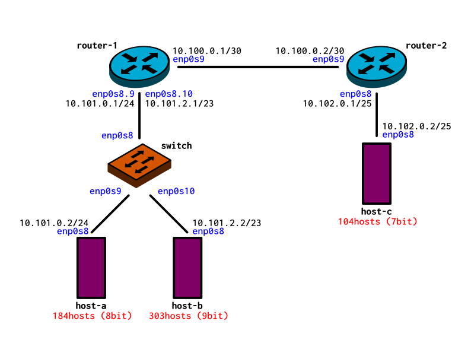

# DNCS-LAB

This repository contains the Vagrant files required to run the virtual lab environment used in the DNCS course.
```


        +-----------------------------------------------------+
        |                                                     |
        |                                                     |eth0
        +--+--+                +------------+             +------------+
        |     |                |            |             |            |
        |     |            eth0|            |eth2     eth2|            |
        |     +----------------+  router-1  +-------------+  router-2  |
        |     |                |            |             |            |
        |     |                |            |             |            |
        |  M  |                +------------+             +------------+
        |  A  |                      |eth1                       |eth1
        |  N  |                      |                           |
        |  A  |                      |                           |
        |  G  |                      |                     +-----+----+
        |  E  |                      |eth1                 |          |
        |  M  |            +-------------------+           |          |
        |  E  |        eth0|                   |           |  host-c  |
        |  N  +------------+      SWITCH       |           |          |
        |  T  |            |                   |           |          |
        |     |            +-------------------+           +----------+
        |  V  |               |eth2         |eth3                |eth0
        |  A  |               |             |                    |
        |  G  |               |             |                    |
        |  R  |               |eth1         |eth1                |
        |  A  |        +----------+     +----------+             |
        |  N  |        |          |     |          |             |
        |  T  |    eth0|          |     |          |             |
        |     +--------+  host-a  |     |  host-b  |             |
        |     |        |          |     |          |             |
        |     |        |          |     |          |             |
        ++-+--+        +----------+     +----------+             |
        | |                              |eth0                   |
        | |                              |                       |
        | +------------------------------+                       |
        |                                                        |
        |                                                        |
        +--------------------------------------------------------+


```

# Requirements
 - Python 3
 - 10GB disk storage
 - 2GB free RAM
 - Virtualbox
 - Vagrant (https://www.vagrantup.com)
 - Internet

# How-to
 - Install Virtualbox and Vagrant
 - Clone this repository
`git clone https://github.com/fabrizio-granelli/dncs-lab`
 - You should be able to launch the lab from within the cloned repo folder.
```
cd dncs-lab
[~/dncs-lab] vagrant up
```
Once you launch the vagrant script, it may take a while for the entire topology to become available.
 - Verify the status of the 4 VMs
 ```
 [dncs-lab]$ vagrant status                                                                                                                                                                
Current machine states:

router                    running (virtualbox)
switch                    running (virtualbox)
host-a                    running (virtualbox)
host-b                    running (virtualbox)
```
- Once all the VMs are running verify you can log into all of them:
`vagrant ssh router`
`vagrant ssh switch`
`vagrant ssh host-a`
`vagrant ssh host-b`
`vagrant ssh host-c`

# Assignment
This section describes the assignment, its requirements and the tasks the student has to complete.
The assignment consists in a simple piece of design work that students have to carry out to satisfy the requirements described below.
The assignment deliverable consists of a Github repository containing:
- the code necessary for the infrastructure to be replicated and instantiated
- an updated README.md file where design decisions and experimental results are illustrated
- an updated answers.yml file containing the details of your project

## Design Requirements
- Hosts 1-a and 1-b are in two subnets (*Hosts-A* and *Hosts-B*) that must be able to scale up to respectively 184 and 303 usable addresses
- Host 2-c is in a subnet (*Hub*) that needs to accommodate up to 104 usable addresses
- Host 2-c must run a docker image (dustnic82/nginx-test) which implements a web-server that must be reachable from Host-1-a and Host-1-b
- No dynamic routing can be used
- Routes must be as generic as possible
- The lab setup must be portable and executed just by launching the `vagrant up` command

## Tasks
- Fork the Github repository: https://github.com/fabrizio-granelli/dncs-lab
- Clone the repository
- Run the initiator script (dncs-init). The script generates a custom `answers.yml` file and updates the Readme.md file with specific details automatically generated by the script itself.
  This can be done just once in case the work is being carried out by a group of (<=2) engineers, using the name of the 'squad lead'. 
- Implement the design by integrating the necessary commands into the VM startup scripts (create more if necessary)
- Modify the Vagrantfile (if necessary)
- Document the design by expanding this readme file
- Fill the `answers.yml` file where required (make sure that is committed and pushed to your repository)
- Commit the changes and push to your own repository
- Notify the examiner (fabrizio.granelli@unitn.it) that work is complete specifying the Github repository, First Name, Last Name and Matriculation number. This needs to happen at least 7 days prior an exam registration date.

# Notes and References
- https://rogerdudler.github.io/git-guide/
- http://therandomsecurityguy.com/openvswitch-cheat-sheet/
- https://www.cyberciti.biz/faq/howto-linux-configuring-default-route-with-ipcommand/
- https://www.vagrantup.com/intro/getting-started/


# Design

## Network topology


First of all, in oreder to accomplish the task it is necessary to set up the netmasks and the ip addresses of the subnets.

In the subnet host-a it is necessary to scale up 184 usable addresses, so I decided to use a netmask of `255.255.255.0` that allows 255 addresses. Considering that one of them is used for the broadcast and another for the gateway (router-1) we obtain 253 usable addresses. I decided to give to this subnet a network address of `101.0.0.0/24`.

Similarly, for the host-b subnet I used an address of `101.0.2.0/23` because, in this case with 303 hosts, we need at least 9 bits for the host address. In fatc with 9 bits we obtain 2^9 - 2 = 510 usable addresses.

Finally, for the host-c we have only 104 hosts so 7 bits of host address are enaugh. To be sure, 2^7 - 2 = 125 usable addresses. The network address chosen is `102.0.0.0/25`.

We also need another subnet which connects the two routers. Only two hosts to address but including the broadcast address we need at least 2 bits (2^2 - 1 = 3). I opted for a `100.0.0.0/30` network address.

host-a and host-b need to be in two separate netwok but due to the fact that they are connected to the same switch and router-1 has only one NIC connected to the switch I decided to use VLANs. In particular we have VLAN tag 9 used to manage the network `101.0.0.0` and VLAN tag 10 for network `101.0.2.0`.

## host-a

For host-a I added a file to the provision that runs at every start up of the machine with these three lines:

```bash
ifconfig enp0s8 101.0.0.2 netmask 255.255.255.0 broadcast 101.0.0.255 up
ip route add 101.0.2.0/23 via 101.0.0.1 dev enp0s8
ip route add 102.0.0.0/25 via 101.0.0.1 dev enp0s8
```

The first one configures the interface `enp0s8` with the ip `101.0.0.2/25` and with the broadcast address set to `101.0.0.255`.

The second one configures the route for reaching host-b. It says: in order to reach the netowrk `101.0.2.0/23` it is necessary to contact the gateway with ip `101.0.0.1` using the interface `enp0s8`.

Similarly, the third line allow host-a to connect to host-c.

## host-b

The same configuration as host-a is used for host-b changing the ip addresses and the netmask according with the previous choices.

```bash
ifconfig enp0s8 101.0.2.2 netmask 255.255.254.0 broadcast 101.0.3.255 up
ip route add 101.0.0.0/24 via 101.0.2.1 dev enp0s8
ip route add 102.0.0.0/25 via 101.0.2.1 dev enp0s8
```

## host-c

host-c has also a script that runs only when the machine is installed. This script is used to install docker and to pull the `dustnic82/nginx-test` image.

```bash
curl -fsSL https://download.docker.com/linux/ubuntu/gpg | sudo apt-key add -
add-apt-repository "deb [arch=amd64] https://download.docker.com/linux/ubuntu $(lsb_release -cs) stable"
apt-get update
apt-get install -y docker-ce docker-ce-cli containerd.io

docker pull dustnic82/nginx-test
```
We also have a script that runs at every start up which configures the network and runs the docker image.

```bash
ifconfig enp0s8 102.0.0.2 netmask 255.255.255.128 broadcast 102.0.0.127 up
ip route add 101.0.0.0/24 via 102.0.0.1 dev enp0s8
ip route add 101.0.2.0/23 via 102.0.0.1 dev enp0s8

docker run -d -p 80:80 dustnic82/nginx-test
```

In this, the first three lines acts as for host-a and host-b. The last one runs the docker image as daemon connecting port 80 to the port 80 of host-c.

In order to run docker on host-c it was necessary to increase the vb-memory to 512 in the Vagrantfile.

## switch

As for the host-c we have a script executed when the machine is created and another executed at every start up.

The first is used to install openvswitch and other useful programs and for configure the VLANs. In particular I created a bridge (called mainbridge) at which I added `enp0s8` as a trunk port (so it is able to manage traffic from both VLANs), `enp0s9` as VLAN tag 9 and `enp0s10` as VLAN tag 10.

```bash
apt-get update
apt-get install -y tcpdump
apt-get install -y openvswitch-common openvswitch-switch apt-transport-https ca-certificates curl software-properties-common

ovs-vsctl add-br mainbridge
ovs-vsctl add-port mainbridge enp0s8
ovs-vsctl add-port mainbridge enp0s9 tag=9
ovs-vsctl add-port mainbridge enp0s10 tag=10
```

At every start up it is necessary to bring up the interfaces, so I write this script:

```bash
ip link set enp0s8 up
ip link set enp0s9 up
ip link set enp0s10 up
```
## routers

Each router has a script that runs when the machine is created before the others:

```bash
echo 'net.ipv4.ip_forward=1' >> /etc/sysctl.conf
sysctl --system  
```

It is used to allow ip forwarding otherwise the routers do not forward the packets from the subnets.

## router-1

For router-1 I used a script that run ones for installing vlan package simply:

```bash
apt-get install vlan
```

At every start up there is a script that configures router-1 for managing both VLANs:

```bash
ip link set enp0s8 up
modprobe 8021q
vconfig add enp0s8 9
ip addr add 101.0.0.1/24 dev enp0s8.9
vconfig add enp0s8 10
ip addr add 101.0.2.1/23 dev enp0s8.10
ip link set enp0s8.9 up
ip link set enp0s8.10 up

ifconfig enp0s9 100.0.0.1 netmask 255.255.255.252 broadcast 100.0.0.3 up
ip route add 102.0.0.0/25 via 100.0.0.2 dev enp0s9
```

After bringing up `enp0s8` and configured router/1 with the standard `802.1q`, tag 9 and 10 are added. router-1 has is `101.0.0.1/24` for the VLAN tag 9 and `101.2.0.2/23` for VLAN tag 10. Also `enp0s8.9` and `enp0s8.10` need to be bringed up.

The last two lines are used to configure `enp0s9` and the route to contact Host-c via `100.0.0.2` (router-2).


## router-2

For the router-2 we have this line of code:

```bash
ifconfig enp0s8 102.0.0.1 netmask 255.255.255.128 broadcast 102.0.0.127 up
ifconfig enp0s9 100.0.0.2 netmask 255.255.255.252 broadcast 100.0.0.3 up
ip route add 101.0.0.0/24 via 100.0.0.1 dev enp0s9
ip route add 101.0.2.0/23 via 100.0.0.1 dev enp0s9
```

They are used to bringing up the two network card interfaces and to configure the route for the subnets Host-a and Host-b. In detail with the third (and the fourth) line we say that to arrive at `101.0.0.0/24` (or `101.0.2.0/23`) we need to contact `100.0.0.1` (router-1) using `enp0s9`.

## Test

In order to test the work done, after running `vagrant up` and connect to host-a (or host-b) using `vagrant ssh host-a` or (`vagrant ssh host-b`) I try to connect to host-c using:

```bash
curl 102.0.0.2
```

And the output was:

```html
<!DOCTYPE html>
<html>
<head>
<title>Hello World</title>
<link href="data:image/png;base64,iVBORw0KGgoAAAANSUhEUgAAAEAAAABACAYAAACqaXHeAAAGPElEQVR42u1bDUyUdRj/iwpolMlcbZqtXFnNsuSCez/OIMg1V7SFONuaU8P1MWy1lcPUyhK1uVbKcXfvy6GikTGKCmpEyoejJipouUBcgsinhwUKKKJ8PD3vnzsxuLv35Q644+Ue9mwH3P3f5/d7n6/3/3+OEJ/4xCc+8YQYtQuJwB0kIp+JrzUTB7iJuweBf4baTlJ5oCqw11C/JHp+tnqBb1ngT4z8WgReTUGbWCBGq0qvKRFcHf4eT/ZFBKoLvMBGIbhiYkaQIjcAfLAK+D8z9YhjxMgsVUGc84+gyx9AYD0khXcMfLCmUBL68HMZ+PnHxyFw3Uwi8B8hgJYh7j4c7c8PV5CEbUTUzBoHcU78iIl/FYFXWmPaNeC3q4mz5YcqJPI1JGKql2Z3hkcjD5EUznmcu6qiNT+Y2CPEoH3Wm4A/QERWQFe9QQ0caeCDlSZJrht1HxG0D3sOuCEiCA1aj4ZY3Ipzl8LiVtn8hxi5zRgWM8YYPBODF/9zxOLcVRVs+YGtwFzxCs1Bo9y+avBiOTQeUzwI3F5+kOwxsXkkmWNHHrjUokqtqtSyysW5gUHV4mtmZEHSdRkl+aELvcFIRN397gPPXD4ZgbxJW1S5OJdA60MgUAyHu1KfAz+pfCUtwr+HuQc8ORQ1jK4ZgGsTvcY5uQP5oYkY2HfcK5sGLpS6l1xZQwNn7Xkedp3OgMrWC1DX0Qwnms/A1rK9cF9atNVo18DP/3o5fF99BGo7LFDRWgMJJQaYQv/PyOcHySP0TITrBIhYb+WSHLrlNGEx5NeXgj2paW8C5rs46h3Dc3kt3G2Ogr9aqoes+f5RvbL1aJ5iXnKnxkfIEoB3N/zHeHAmF9ovwryvYvC9TysnICkEonPX212vvOU8+As6eS+QCDAw0aNLABq6LO8DkJMSSznMMEfScFFGwCJYXbDV7lq17RYIQu+QTYpjRUBM3gZQIt+cOwyTpWRpYBQRsKrgU4ceNS4JkCSxLI1+ZsIS0NvXB6sLE/tL5EQkQJKOm52YON9y7glqJkCSOqzrD6Uvc1wZ1EBA07V/IafmN4ckHG+ugJkSEHuVQQ0ENFy9BLP3R0NR4ymHJGRWFWBnZ6fPVwMBF9EDgrD2z0USqtoaHJKw49SBoZ2dWggIxmcEsvspYLLi4PKNDrvv68OfuKLt/68MqiJAan4Q0IpDm6G7r8fue692X4fI7PiByqA6AqygNh0XHIaClDOkpz9aGVRJABo8CTP+3sqfHZJQeqkSgvHZn+xaqEICKAlhECSGO60MWdVF4IcesDL/ExUSYN3okCrD31fqHZLwcWkq5owPVUoA3UcIgdBv10BrV7vdz3b39kBhw0kVE2BNirG/bqRghyPqIcBKQkKJcVgE1LQ1wR3S5ooqCDBKlSEUzGdyFBNwvq1RTQT0b4BOF5+BgoayCUqAtTLMSXsRzl6uHX8EONoUtXS2KCfAusOsyVwFLV1tznNAuzflAGxb+R/esGuodDcD0bUVbYLelhRf/mWD08ogdYtTjNwYbIsrORhBIwJMPOTWHh1i6Lriz107FUKviivcZvfp8WZvN8TmbVS2rtsHI8mMtn9gSe50KAz79yWw8490OGYpp8lsTUGictd3EA6PHVwB20+mYUNURo/aMs4dhqjsdcoOWGxH5yYu0g0P0EzFBd7DxZoVHY7aHmWtB6VunwhLB6P0gFULk6zhJnvnBw5HW9D9N5GkpQEjMBcQOg+JMBNxjMZgHISawvGZHiKw+0mybv5ozP0txgvk07AQvWxAoh98sXsur3RmwMStxIud9fiIzMAIXTV6yNqxHaH7gg1GA7bgxVvHfEjq1hAl10ZM/A46gO0x0bOPoiHpSEDvsMZhXVVbVRL4TLz2E140EK1dgsnnd9mBaHcmwuigJHeCGLkXvHNaNHOBP4J/HYmoGbGwsJU1ka0nAvM2ht40758ZNmvvRRJ24l3roMa7MxVq4jpRdyMRc8bh9wR0TyIRWdR9hzNXaJs3Ftif6KDWuBcBH0hErky2bNraV5E9jcBjiapE1ExHkO8iEY1OvjLTjAkugezh7ySqFUPoXHTtZAR7ncY4rRrYYgtcCtGHPUgmjEhPmiKXjXc/l4g6HfGJT3ziEw/If86JzB/YMku9AAAAAElFTkSuQmCC" rel="icon" type="image/png" />
<style>
body {
  margin: 0px;
  font: 20px 'RobotoRegular', Arial, sans-serif;
  font-weight: 100;
  height: 100%;
  color: #0f1419;
}
div.info {
  display: table;
  background: #e8eaec;
  padding: 20px 20px 20px 20px;
  border: 1px dashed black;
  border-radius: 10px;
  margin: 0px auto auto auto;
}
div.info p {
    display: table-row;
    margin: 5px auto auto auto;
}
div.info p span {
    display: table-cell;
    padding: 10px;
}
img {
    width: 176px;
    margin: 36px auto 36px auto;
    display:block;
}
div.smaller p span {
    color: #3D5266;
}
h1, h2 {
  font-weight: 100;
}
div.check {
    padding: 0px 0px 0px 0px;
    display: table;
    margin: 36px auto auto auto;
    font: 12px 'RobotoRegular', Arial, sans-serif;
}
#footer {
    position: fixed;
    bottom: 36px;
    width: 100%;
}
#center {
    width: 400px;
    margin: 0 auto;
    font: 12px Courier;
}

</style>
<script>
var ref;
function checkRefresh(){
    if (document.cookie == "refresh=1") {
        document.getElementById("check").checked = true;
        ref = setTimeout(function(){location.reload();}, 1000);
    } else {
    }
}
function changeCookie() {
    if (document.getElementById("check").checked) {
        document.cookie = "refresh=1";
        ref = setTimeout(function(){location.reload();}, 1000);
    } else {
        document.cookie = "refresh=0";
        clearTimeout(ref);
    }
}
</script>
</head>
<body onload="checkRefresh();">

<div class="info">
<p><span>Server&nbsp;address:</span> <span>172.17.0.2:80</span></p>
<p><span>Server&nbsp;name:</span> <span>7ce959e93d1f</span></p>
<p class="smaller"><span>Date:</span> <span>20/Nov/2020:11:33:55 +0000</span></p>
<p class="smaller"><span>URI:</span> <span>/</span></p>
</div>
<br>
<div class="info">
    <p class="smaller"><span>Host:</span> <span>102.0.0.2</span></p>
    <p class="smaller"><span>X-Forwarded-For:</span> <span></span></p>
</div>

<div class="check"><input type="checkbox" id="check" onchange="changeCookie()"> Auto Refresh</div>
    <div id="footer">
        <div id="center" align="center">
            Request ID: 9d3604146aaafa35629ac51047b1f89f<br/>
            &copy; NGINX, Inc. 2018
        </div>
    </div>
</body>
</html>
```

This means that host-c is reachable from both host-a and host-b and has a running docker image which contains an http server.

Also ping tests are runned successfully in particular, using tcpdump, I observed that to contact host-b from host-a (and viceversa) the packets flows through router-1 because they are in different subnets.
